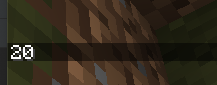

# 配置文件

在这节中，我们将要来学习配置文件的编写。在1.12之后，Forge将配置文件格式改成Toml。

现在我们开始吧

为了理解方便，我先把最后生成出的配置文件格式粘贴出来

```toml
#General settings
[general]
	#Test config value
	#Range: > 0
	value = 10
```

```java
public class Config {
    public static ForgeConfigSpec COMMON_CONFIG;
    public static ForgeConfigSpec.IntValue VALUE;

    static {
        ForgeConfigSpec.Builder COMMON_BUILDER = new ForgeConfigSpec.Builder();
        COMMON_BUILDER.comment("General settings").push("general");
        VALUE = COMMON_BUILDER.comment("Test config value").defineInRange("value", 10, 0, Integer.MAX_VALUE);
        COMMON_BUILDER.pop();
        COMMON_CONFIG = COMMON_BUILDER.build();
    }
}
```

创建一个配置文件可以大致分为一下几个部分，首先你得创建一个`Builder`，然后向这个`Builder`塞入你需要的配置选项，以及注释等，最后调用其`build`方法，构建出我们的配置实例。

我们先来看静态代码块中的内容。

首先我们调用`ForgeConfigSpec.Builder()`创建了一个`Builder`。

接下来的`push`和`pop`是一组方法，必须配合使用，每一个`comment`对应了配置文件中一个节（也就是中括号的部分），其中的`push`规定了节的名字，`comment`则是添加了注释。

`ForgeConfigSpec.IntValue`规定了我们的值，这里的值的允许的种类可以有：EnumValue、LongValue、IntValue、BoolenValue、DoubleValue。

我们在这里通过`defineInRange`方法定义了我们配置文件中选项的名字，默认值，以及值的范围。

最后我们通过`COMMON_BUILDER.build()`，构建出了我们配置文件的实例。

当然，你还需要注册这个配置文件，回到你的Mod主类的构造方法中，添加

```java
ModLoadingContext.get().registerConfig(ModConfig.Type.COMMON, Config.COMMON_CONFIG);
```

Forge 提供了不同种类的配置文件，比如服务端起效，客户端起效的等，这里我们通过`ModConfig.Type.COMMON`选用了通用的配置文件。

到此你配置文件就已经注册完毕了。

你的配置文件的名字将会是`modid-common.toml`。

使用配置文件里的值，也是非常的简单。

```java
public class ConfigureTestItem extends Item {
    public ConfigureTestItem() {
        super(new Properties().group(ModGroup.itemGroup));
    }

    @Override
    public ActionResult<ItemStack> onItemRightClick(World worldIn, PlayerEntity playerIn, Hand handIn) {
        if (!worldIn.isRemote) {
            playerIn.sendMessage(new StringTextComponent(Integer.toString(Config.VALUE.get())));
        }
        return super.onItemRightClick(worldIn, playerIn, handIn);
    }
}
```

直接通过`Config.VALUE.get()`就可以获取配置文件中的值了。

修改你的配置文件，你可以看到物品栏的消息也发生了改变。




[源代码](https://github.com/FledgeXu/NeutrinoSourceCode/tree/master/src/main/java/com/tutorial/neutrino/configure)

