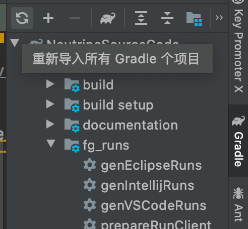
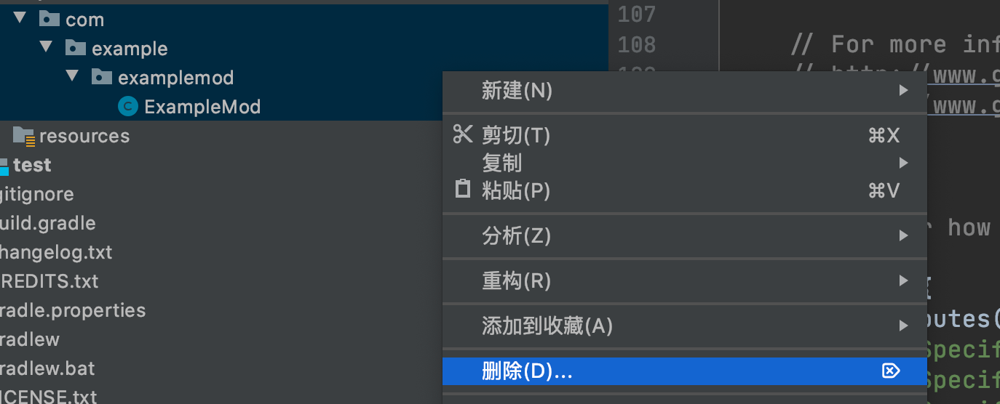
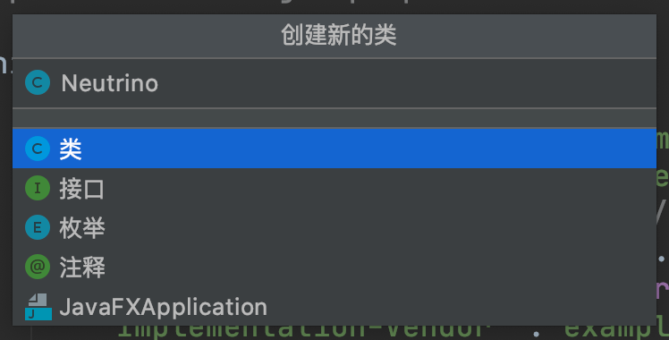
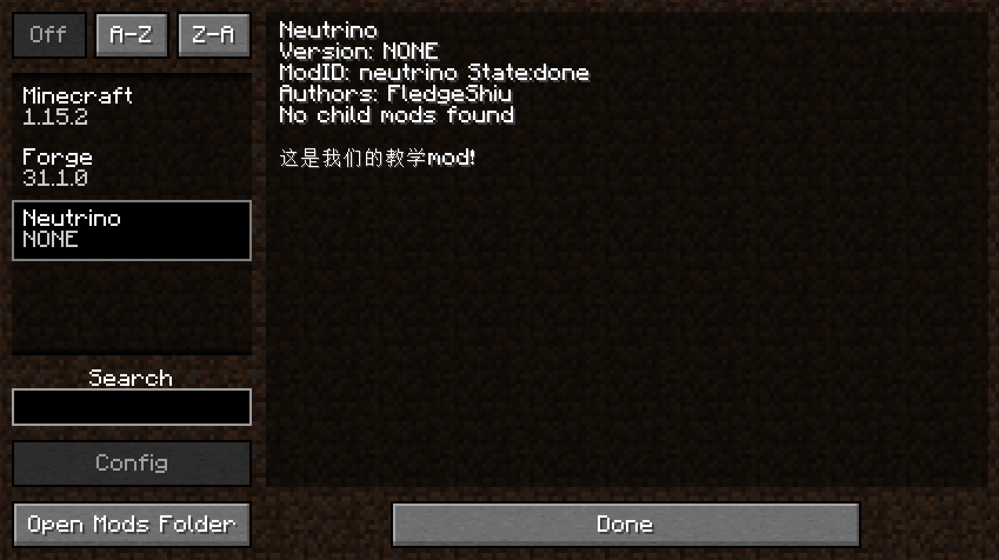

# 自定义mod信息

从这节起我们就会开始正式的写我们mod了！

## 更新Mappings

在开始之前我们需要更新一下Mapping文件，如果不知道Mapping文件的作用，请向前翻阅。再提醒一次，你可以在[这里](http://export.mcpbot.bspk.rs/)找到最新的mapping文件。

**请确保你的mappings文件版本新于`20200512-1.15.1`**。


于是我们需要将`build.gradle`下的`mappings channel: 'snapshot', version: '20190719-1.14.3’`修改为`mappings channel: 'snapshot', version: '20200512-1.15.1’`。


然后点击右侧Gradle面板的重新导入按钮，重新导入项目，因为`build.gradle`文件非常的重要，请注意不要改错。



这个过程可能会涉及下载文件（但不会很多），有出现错误的可能性，出错了请检查你的`build.gradle`内容有没有填错，然后多试几次。

## 配置

首先我们选中`java`文件夹下所有的目录和文件，然后右键删除Java包下的默认类。



然后再右键新建立一个包


在默认情况下你的包名应该是你的域名的倒写，因为我不想用自己的域名举例子，所以这里我填入的内容是`com.tutorial.neutrino`。

创建完成以后右击创建一个Java类，名字叫做`Neutrino`，请注意大小写，在默认情况下Java的类名遵循「帕斯卡命名法」[^1]。




创建完成后目录树如下：

```
java
└── com
    └── tutorial
        └── neutrino
            └── Neutrino.java
```

然后进入`Neutrino`在类名的上方添加一个`@Mod()`注解，其中填入的参数是你的`modId`，那么什么是你的`modId`呢？`modId`就是你mod名字的唯一标识符，请注意`modId`和你的mod名字不是同一个东西，它不允许大写字母，也不允许空格等内容。在这里我们选用的`modId`是`neutrino`。添加完成后内容如下:

```java
@Mod("neutrino")
public class Neutrino {
}
```

接下来我们需要去修改处于`resources=>META-INF`下的`mods.toml`。在默认情况下IntelliJ是没有对Toml文件语法高亮的，如果你需要像我一样的语法高亮可以去安装一个`Toml`插件，安装方式和你安装语言包是一样的。

`mods.toml`是我们mod信息的配置文件，在这里我们可以修改我们mod的名字，介绍等内容。其中有许多配置项，如果一个配置项的注释里含有`#mandatory`说明这个配置项是必须的，如果注射里写的的是`#optional`，说明这个配置项是可选的，你可以在配置项前面加上`#`来注释掉这个配置项。

|     配置项      |                        作用                         |
| :-------------: | :-------------------------------------------------: |
|    modLoader    |       规定mod的Loader，大部分情况下不需要修改       |
|  loaderVersion  |  规定了mod运行的Forge版本，大部分情况下不需要修改   |
| issueTrackerURL |         可选，你的Mod Bug提交地址，按需修改         |
|      modId      | 必填，这里需要填入你的`modId`，和代码中的要保持一致 |
|     version     |            必填，一般情况下保持默认即可             |
|   displayName   |     必填，显示名称，你的mod在Mod界面的显示名称      |
|  updateJSONURL  |               可选，你的mod的更新链接               |
|   displayURL    |             可选，你的mod介绍网页的链接             |
|    logoFile     |                 可选，你的Mod的Logo                 |
|     credits     |               可选，你的Mod的致谢名单               |
|     authors     |               可选，你的mod的作者名单               |
|   description   |            必填，你的mod在mod界面的介绍             |

接下剩下的都是依赖，Forge官方的例子已经写的很清楚了，这里我们不多加说明

我修改完的`mods.toml`如下:

```toml
modLoader="javafml"
loaderVersion="[31,)" 
[[mods]] #mandatory
modId="neutrino" 
version="${file.jarVersion}" 
displayName="Neutrino" 
authors="FledgeShiu" 
description='''
这是我们的教学mod！
'''
```

现在我们已经修改完我们的mod信息了，现在让我打开游戏。



可以看见我们的Mod已经出现了！

## 开发小课堂

介于目标读者的水平，在这里特增「开发小课堂」环节。

在这次开发小课堂中，我们来讲一讲「日志」，日志你在开发过程中最重要的Debug工具之一，在向别人提问时，你需要提供的三样东西中的其中一项，另外两项是完整的代码和问题清晰到位的问题描述。

如果代码出了问题，你首先需要做的事就是阅读日志，什么你说全英文的看不懂怎么办？现在这么多翻译网站随便找一个把日志粘贴上去翻译啊。

如果你问文件形式的日志在哪里，是你开发目录下的`run/logs/run.log`。

---

[^1]:「帕斯卡命名法」的意思是：名字中所有的单词首字母都是大写，比如「HelloWorld」