# Forge开发环境的配置

## 需要的工具

-  [JDK8](https://www.oracle.com/java/technologies/javase-jdk8-downloads.html)，出于兼容性的考虑，**请确保你安装的是JDK8**。
- [IntelliJ IDEA 2020.1.1 社区版](https://www.jetbrains.com/zh-cn/idea/download/)，下载完成后请自行安装，介于目标读者的水平，这里有个如何给2020.1之后的版本安装官方中文的[教程](https://www.bilibili.com/video/BV1NT4y137nb)。

- [Forge MDK 1.15.2 - 31.1.0](https://files.minecraftforge.net/maven/net/minecraftforge/forge/1.15.2-31.1.0/forge-1.15.2-31.1.0-mdk.zip)，下载后请解压到你喜欢的文件夹。

**注意，介于预想读者的水平，配置过程十有八九是会失败的，建议直接使用[离线包](https://v2mcdev.com/t/topic/249/2)，安装完离线包之后继续按照下述教程进行配置。**

## 总体的介绍

Minecraft Forge是一个Gradle项目，Gradle是一个项目构建工具，其主要作用是负责项目的依赖管理、构建等功能。依赖管理指的是帮你自动地下载和配置你开发中使用的库，也就是别人写好的方便你自己开发的代码。构建指的是将你写的mod打包成别人可以安装的jar文件。

Forge官方写了一个叫做ForgeGradle（以后简称FG）的插件来负责整个mod开发环境的配置（~~为什么要说这个呢，让你知道当环境配置失败时该骂谁~~)。

## IDEA的编码配置（Windows用户专用）

选择Configure下的`设置/首选项`。

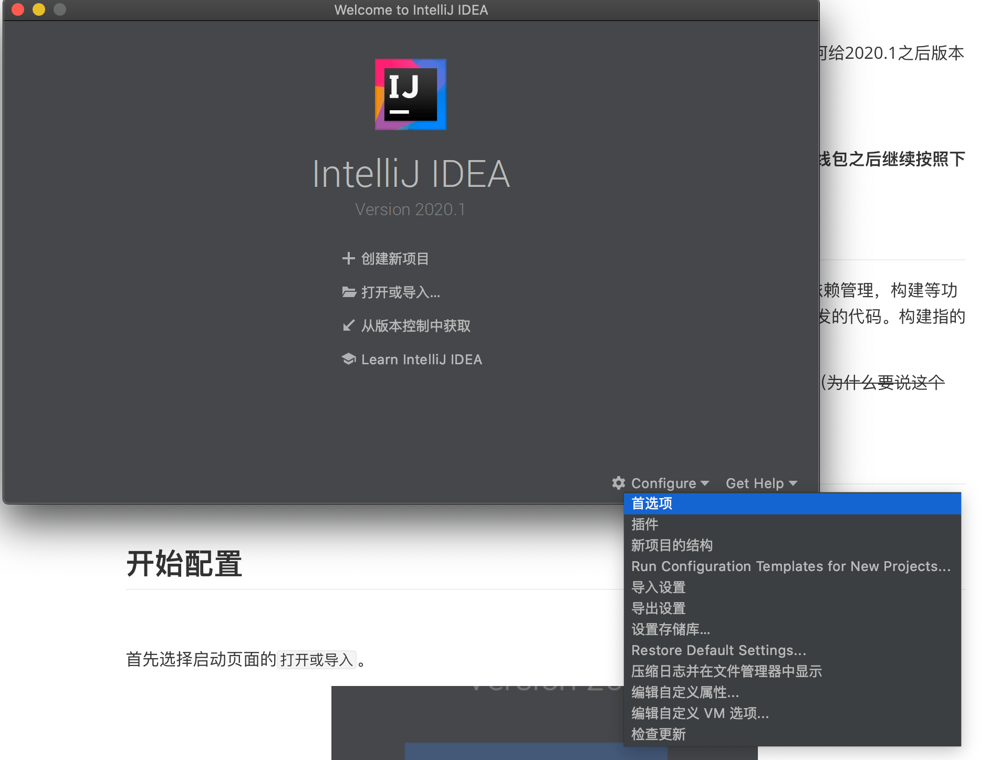

选择`编辑器=>文件编码`，将右侧所有涉及到编码全部改成`UTF-8`，并把`创建UTF-8文件`改成`With NO BOM`。

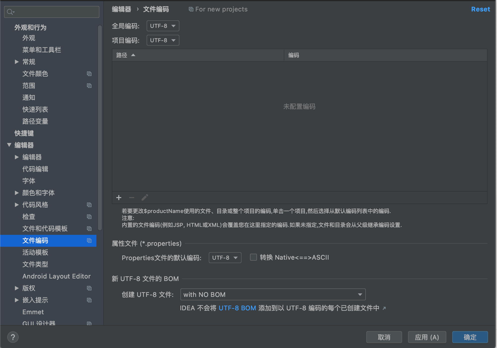

## 开始配置

首先选择启动页面的`打开或导入`。

选择你MDK解压目录下的`build.gradle`打开。

选择作为`项目打开`

打开之后，根据你网络情况和电脑自身的情况，会有或长或短的导入时间，这个过程需要下载很多的依赖包而这些依赖包都存放在海外，介于中国大陆网络封锁策略导致海外网络访问不稳定，这个时间将会持续几分钟至几天不等，而且很有可能失败，对于有代理的同学可以自行搜索「Gradle配置代理」来给Gradle加上代理。

当导入结束，点击下方的`build`面板，左侧显示绿勾时说明导入成功。

当导入完成后，点击运行右侧的`Gradle`面板，选择其中的`Tasks`下`fg_runs`下的`genIntelliJRuns`。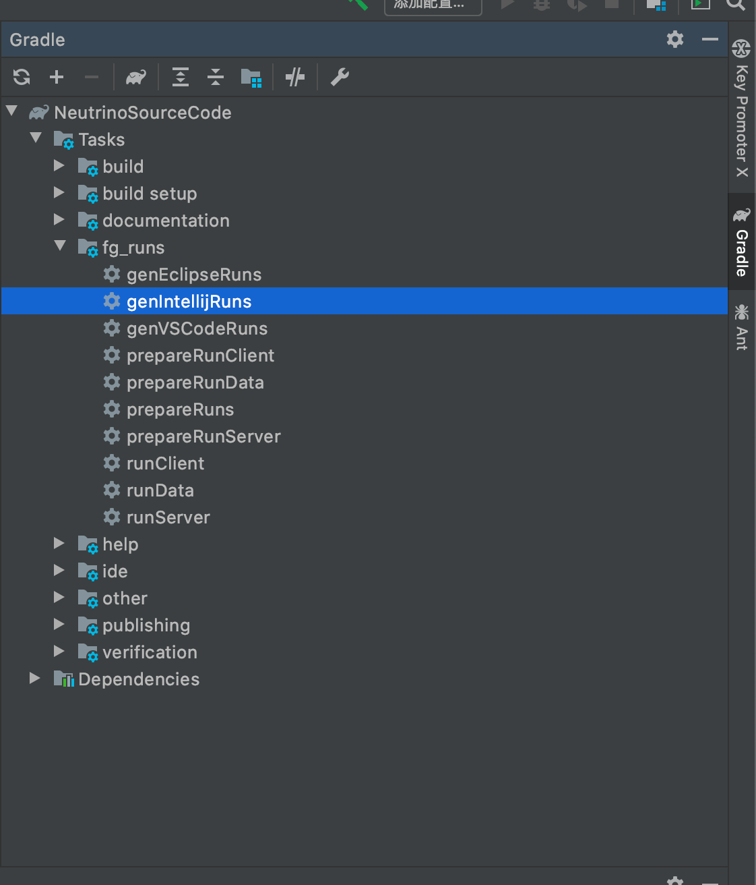

在这一步中，会自动下载剩余的一些依赖，以及Minecraft本体和资源文件。出于和上面相同的理由，这个过程耗时会很长，并且非常容易失败。

同样的当左侧显示「绿勾」时说明配置成功。

点击上方的`运行=>编辑配置`。

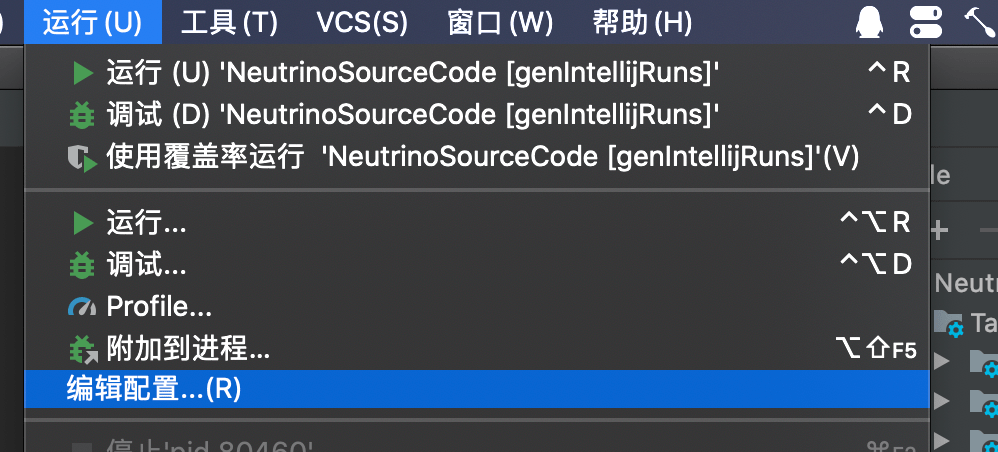

选择`应用程序`下的三项，将其`使用模块的类路径`改成`你文件夹名.main`，点击确定保存。

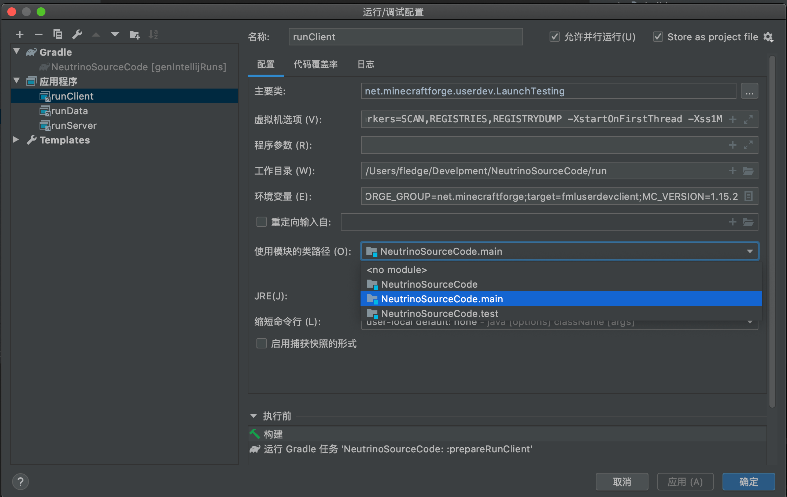

配置完成之后，选择`调试`。

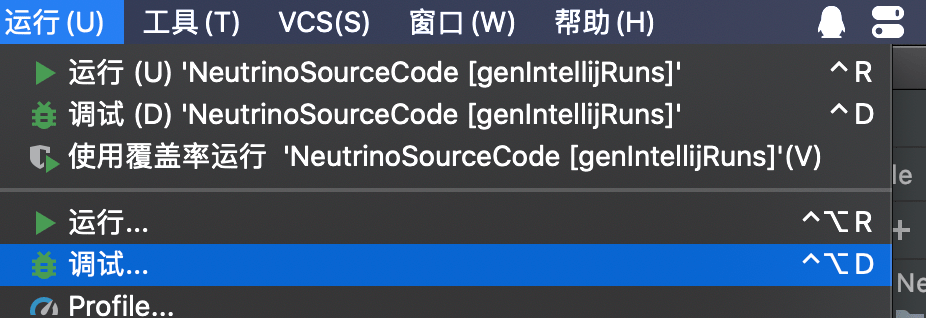

然后选择`runClient`即可启动游戏。

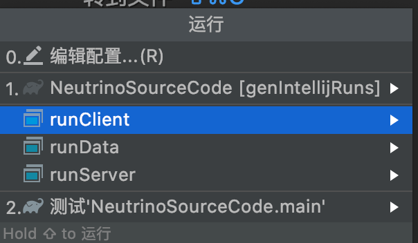

在没有为Gradle配置代理的情况下，`runClient`有时候会耗费非常多的时间，推荐大家购买并配置代理，或者[这个教程](https://v2mcdev.com/t/topic/304)也是一种解决办法。

可以看见我们的游戏成功启动了。

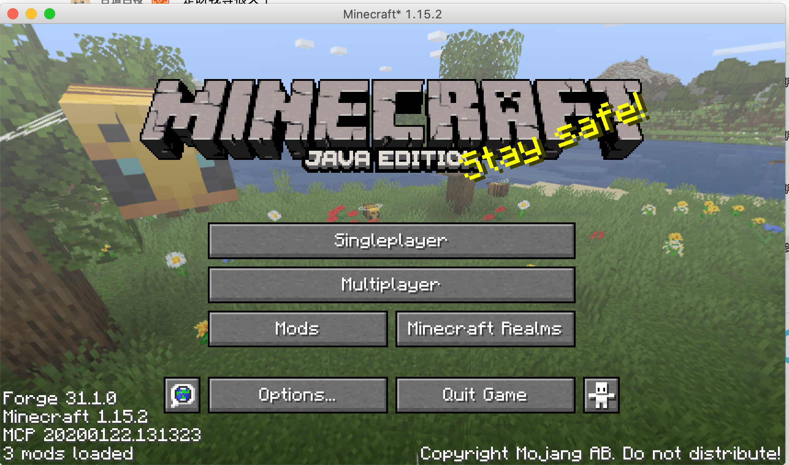

如果大家嫌`控制台`输出太多，可以在`虚拟机选项`中将`-Dforge.logging.console.level=`的值改成`info`。

## JDK常见错误

如果你的电脑里有多个JDK，有可能IntelliJ自动选择的JDK是错误的，导致无法导入，你需要手动修改项目的JDK和Gradle运行所需要的JDK。

选择`文件`下的`项目结构`。

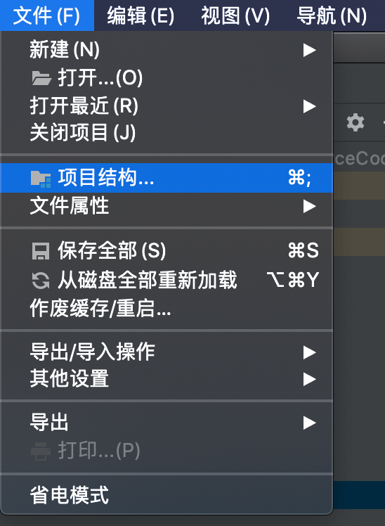

将项目JDK改成1.8版本

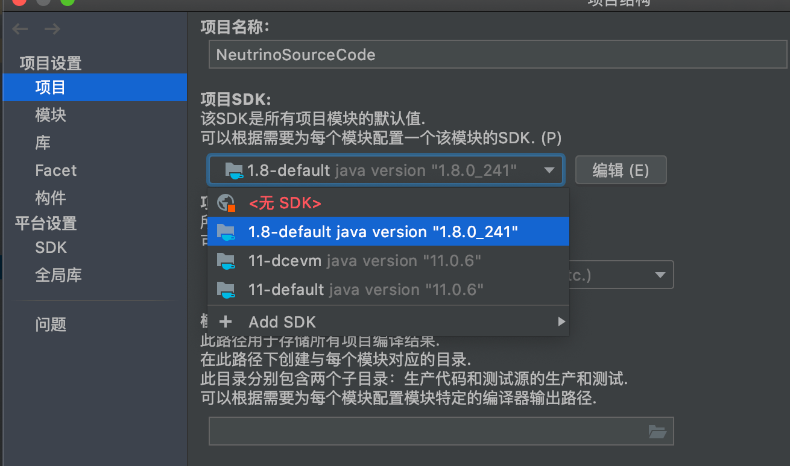

接下去修改gradle的版本，出于一些奇怪的原因，在装了中文插件之后，就无法修改gradle的JDK了，所以首先你得先在设置面板停用中文插件。

然后按照下图，到设置面板，将`Gradle VM`改成`Project JDK`

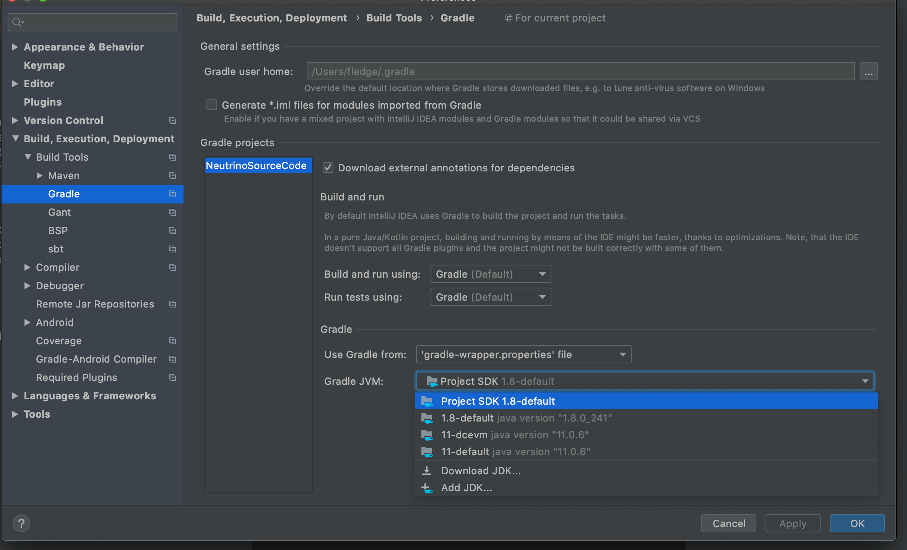

之后再到`Plugin`下的`Installed`重新启动中文插件即可。

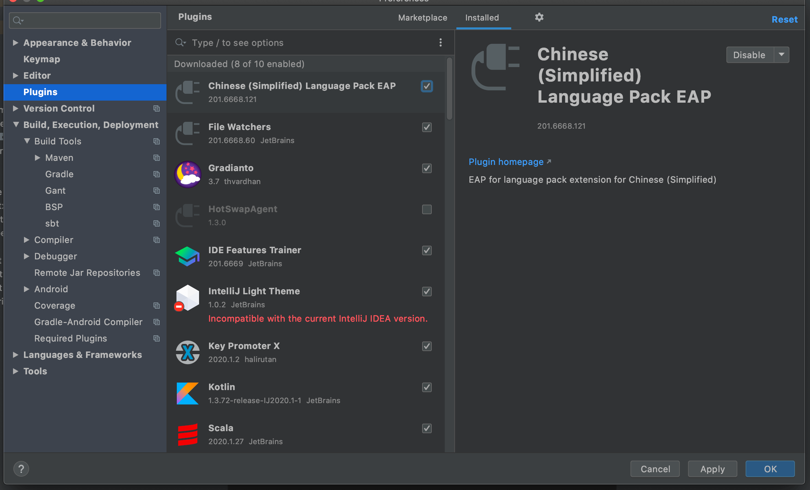

