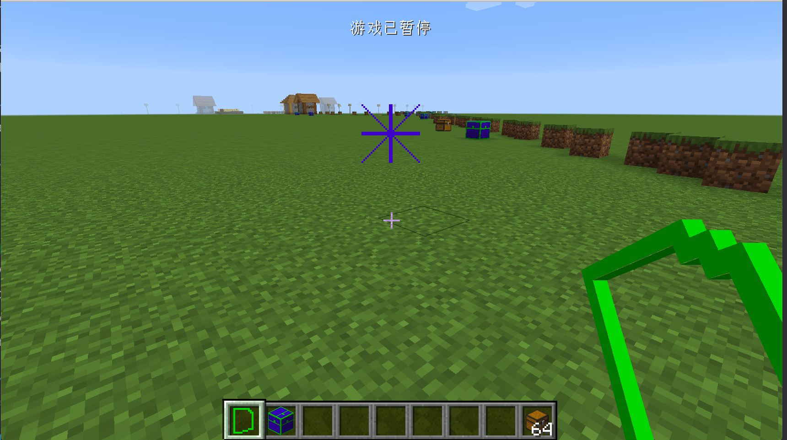

# HUD

在这节中我们将来学习如何绘制HUB。首先以免读者不清楚，HUD或者又称为inGameGui，指的是你在游戏中看到的类似于经验条、准星之类的东西。

那我们开始吧。

Forge给我提供了一个事件让我们可以渲染HUB，这个事件是`RenderGameOverlayEvent` 。

 ```java
@Mod.EventBusSubscriber
public class HudClientEvent {
  
    @SubscribeEvent
    public static void onOverlayRender(RenderGameOverlayEvent event) {
        ObsidianGUI obsidianGUI = new ObsidianGUI();
        if (event.getType() != RenderGameOverlayEvent.ElementType.ALL) {
            return;
        }
        if (Minecraft.getInstance().player == null || Minecraft.getInstance().player.getHeldItem(Hand.MAIN_HAND).getItem() != ItemRegistry.obsidianHud.get()) {
            return;
        }
        obsidianGUI.render();
    }
}
 ```

可以看到，我们订阅了这个事件做了一些判断，最后调用`obsidianGUI.render();`进行了渲染。`RenderGameOverlayEvent`事件有`Pre`和`Post`两个子事件，大家可以按需选用。另外`RenderGameOverlayEvent`这个事件包含有不同的`ElementType`，在渲染你的内容前（特别是要渲染图片时），务必判断一次`ElementType`，以防导致原版内容的错误渲染。

```java
if (Minecraft.getInstance().player == null || Minecraft.getInstance().player.getHeldItem(Hand.MAIN_HAND).getItem() != ItemRegistry.obsidianHud.get()) {
  return;
}
```

这里只是简单的判断玩家手上拿的东西是不是我们规定的物品，因为渲染肯定发生在客户端，所以这里我们调用`Minecraft.getInstance()`。

接下来我们来看`ObsidianGUI`的具体内容。

```java
public class ObsidianGUI extends AbstractGui {
    private final int width;
    private final int height;
    private final Minecraft minecraft;
    private final ResourceLocation HUD = new ResourceLocation("neutrino", "textures/gui/hud.png");

    public ObsidianGUI() {
        this.width = Minecraft.getInstance().getMainWindow().getScaledWidth();
        this.height = Minecraft.getInstance().getMainWindow().getScaledHeight();
        this.minecraft = Minecraft.getInstance();
    }

    public void render() {
        RenderSystem.color4f(1.0F, 1.0F, 1.0F, 1.0F);
        this.minecraft.getTextureManager().bindTexture(HUD);
        blit(width / 2 - 16, height / 2 - 64, 0, 0, 32, 32, 32, 32);
    }

}
```

可以看到我们继承了`AbstractGui`，这允许我们直接使用`AbstractGui`自带的一系列方法，比如`blit`。然后我们在构造方法里，手动的设置里类似于`width` `hegiht`等变量。

然后手动的创建了`render`方法，`render`方法的写法你之前在`Screen`中的`render`的写法是一样的。我在这里就只是渲染了一张图片而已。

打开游戏，把物品拿在手上，你应该就能看见物品被渲染出来了。



[源代码](https://github.com/FledgeXu/NeutrinoSourceCode/tree/master/src/main/java/com/tutorial/neutrino/hud)

另外原版的HUD渲染内容都在`IngameGui`这个类中。

