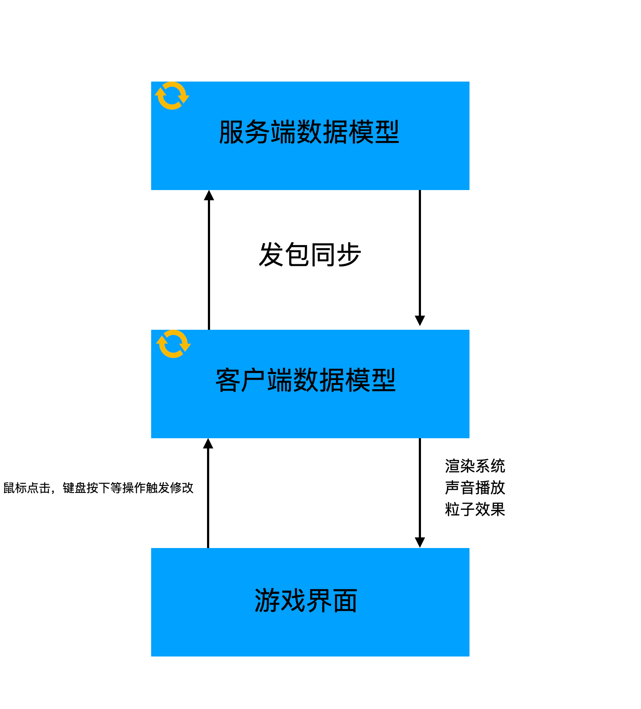

# Minecraft如何运作的

这节的内容非常重要，你必须在自己的大脑中搭建起Minecraft运行的模型图像，不然之后很多概念你会很难理解。

在这一节中，我将介绍一下Minecraft大体上是怎么运作的，以及一个非常重要的概念「端」。

Minecraft大体上属于「C/S架构（客户端/服务端架构）」。那么什么是「服务端」，什么又是「客户端」呢？

从名字上其实就能看出大概的意思，「服务端」是提供服务的，「客户端」是用户直接使用的。那么这两个端在Minecraft中是怎么体现的呢？

在Minecraft中两个端的职责区分如下：

- 服务端

  复杂游戏的逻辑，数据的存储和读写。

- 服务端

  接受用户的输入输出，通过来自服务端的数据渲染游戏画面。

值得注意的是，这里客户端和服务端的区分是逻辑上的区分。实际上如果你处于单人模式，那么你的电脑上会同时存在服务端和客户端，而且他们处于不同的线程[^1]。但是当你连接某个服务器是，你的电脑上只存在客户端，而服务端被转移到了远程的一台服务器上。

下面一张图大概的解释了Minecraft是怎么运作的。

看到这张图，你可能觉得奇怪，说好的是服务端负责游戏逻辑的呢，为什么客户端也有数据模型？其实这里的「客户端数据模型」只是「服务端数据模型」一个副本，虽然它们都有独立的游戏Tick，也共享很多相同的代码，但是最终逻辑还是以服务端为准。

之前我们提到，客户端和服务端是独立运行的，但是它们不可避免的需要同步数据，而在Minecraft里，所有客户端和服务的的数据同步都是通过网络数据包实现的。在大部分时候原版已经实现了数据同步的方法，我们只需要调用设计好的方法就行，但是在一些情况下，原版没有提供这个功能，或者不适合使用原版提供的功能，我们就得自己创建和发送网络数据包来实现数据的同步。

那么接下去的问题是，我们怎么在代码中区分我们是处于客户端还是服务端呢？

Minecraft的`World`中有一个`isRemote`方法，当处于客户端是这个变量值为真，当处于服务端时这个变量值为假。

---

[^1]:线程是程序调度的单位之一，处于不同的线程意味着这两个的逻辑和数据是互相独立的，只能通过特定的方法同步数据。具体来说，服务端处于「Server thread」，客户端处于「Render thread」，如果你有观察过Minecraft启动时的输出日志，应该会看到这两个词。

