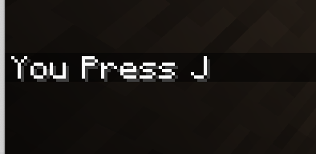
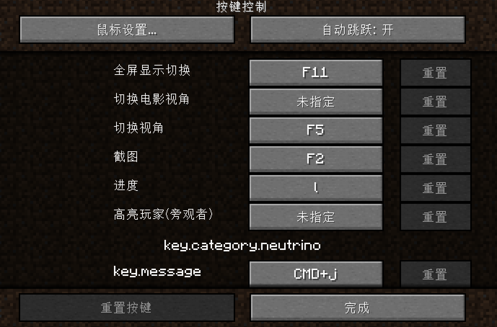

# 用户输入

这一节中我们将来学习如何获取用户输入。这里我们将以快捷键举例。请注意，所有的用户输入都是客户端行为。

```java
@Mod.EventBusSubscriber
public class KeyBoardInput {
    public static final KeyBinding MESSAGE_KEY = new KeyBinding("key.message",
            KeyConflictContext.IN_GAME,
            KeyModifier.CONTROL,
            InputMappings.Type.KEYSYM,
            GLFW.GLFW_KEY_J,
            "key.category.neutrino");

    @SubscribeEvent
    public static void onKeyboardInput(InputEvent.KeyInputEvent event) {
        if (MESSAGE_KEY.isPressed()) {
            assert Minecraft.getInstance().player != null;
            Minecraft.getInstance().player.sendMessage(new StringTextComponent("You Press J"));
        }
    }
}
```

首先我们创建了一个`KeyBinding`，这个就是一个可以配置的快捷键，具体的参数非常简单，这里就不多加说明了。

可以看到，我们监听了Forge总线上的`InputEvent.KeyInputEvent`，即键盘输入事件。`InputEvent`下还有其他子事件，大家可以按需选用。在这里我们判断当我的快捷键按下时，给玩家发送一个消息。

当然我们还需要注册我们的快捷键。

```java
@Mod.EventBusSubscriber(bus = Mod.EventBusSubscriber.Bus.MOD)
public class KeybindingRegistry {
    @SubscribeEvent
    public static void onClientSetup(FMLClientSetupEvent event) {
        ClientRegistry.registerKeyBinding(KeyBoardInput.MESSAGE_KEY);
    }
}
```

因为按钮按下是个客户端行为，所有这里我们选用`FMLClientSetupEvent`事件，在里面调用`ClientRegistry.registerKeyBinding`方法注册我们的快捷键。

打开游戏按下我们之前设置的快捷键，就可以看到我们的消息了。





注：因为我的系统时macOS，所以这里显示的是CMD。

[源代码](https://github.com/FledgeXu/NeutrinoSourceCode/tree/master/src/main/java/com/tutorial/neutrino/input)

