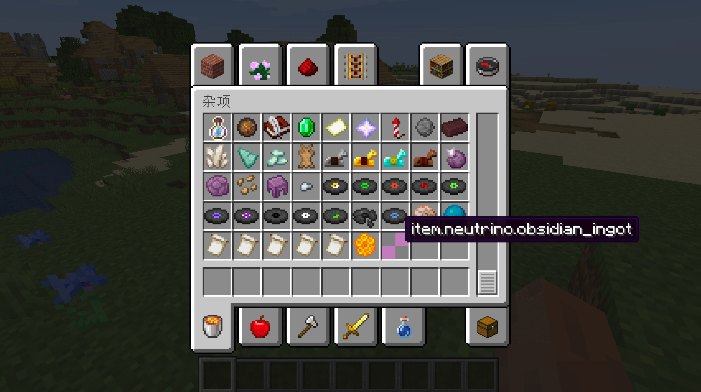
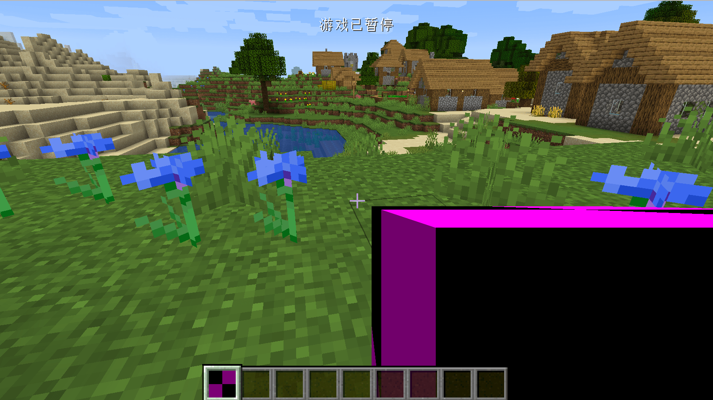
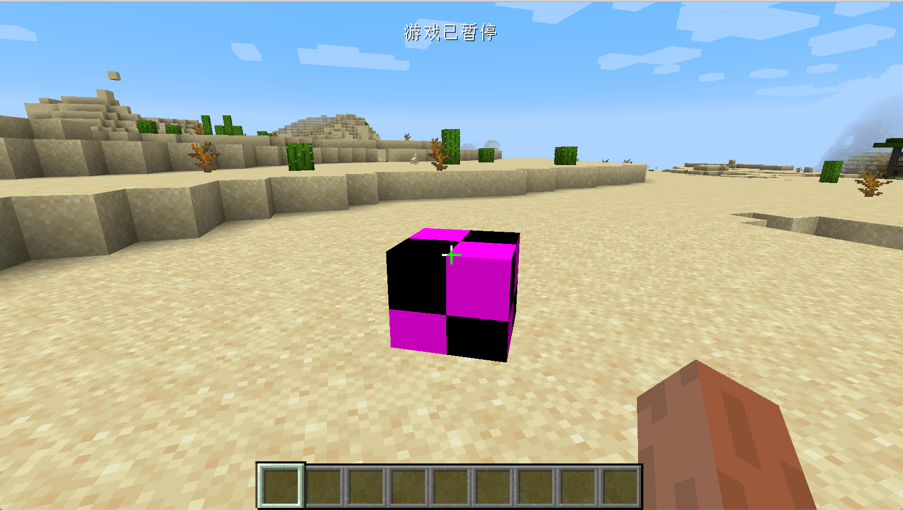

# 第一个物品

从现在开始我们就要正式开始写代码了。首先有几件事要说明，本项目的代码都会开源，每节的代码链接我都会放在文章的后面，而为了之后修正和查看的方便性，我的代码中可能会有大量的重复的类，项目的组织也和正常项目大相径庭，大家请不要照抄，请大家务必手打代码，你复制粘贴代码是学不会的。

首先我们得明确，创建一个物品需要哪几个步骤。答案是三步：创建自己的物品并继承原版的物品的类，实例化这个物品最后把这个物品注册进游戏。

注意上面这些步骤是通用的，很多自定义内容的添加都是遵循着上面这个步骤。

知道了上诉步骤之后，我们就开始添加我们的第一个物品吧，在这里我们将添加一个黑曜石碇。

首先我们需要创建一个要创建物品的类，并且让这个类继承原版的`Item`类（介于目标读者的水平，Item就是物品的英文）。

```java
public class ObsidianIngot extends Item {
    public ObsidianIngot() {
        super(new Properties().group(ItemGroup.MATERIALS));
    }
}
```

这个类的代码非常简单，就是只有一个构造器。

这里唯一值得一说的就是`new Properties().group(ItemGroup.MATERIALS)`，这个`Properties`规定了物品的一些属性，比如是不是食物又比如这个物品在创造模式的哪一个物品栏。

在这里我们创建了一个`Properties`并且调用了`group`方法然后传入了`ItemGroup.MATERIALS`的作用是让这个物品可以在原版的「杂项」创造模式物品栏里。当然你也可以不调用 `group`方法，这样的话就只有通过`/give`命令才能获取到物品了。

接下去我们需要实例化和注册这个物品，在以前这个是分开的两步，但是在Forge加入了一个叫做`DeferredRegister`的机制，使得注册一个物品变得非常的简单。

```java
public class ItemRegistry {
  public static final DeferredRegister<Item> ITEMS = new DeferredRegister<>(ForgeRegistries.ITEMS, "neutrino");
  public static RegistryObject<Item> obsidianIngot = ITEMS.register("obsidian_ingot", () -> {
    return new ObsidianIngot();
  });
}
```

这个就是注册的全部内容，首先我们创建了一个类型为`DeferredRegister<Item>`名字叫做`ITEMS`的变量，这个类型表明我们需要注册的东西是物品，然后通过`new DeferredRegister<>(ForgeRegistries.ITEMS, "neutrino”);`实例化了这个类，这个类里有两个参数`ForgeRegistries.ITEMS`代表了我们要注册的是物品，第二个参数填入的应该是你的`modId`。这样我们就创建好了注册器，接下去就是注册我们的物品。

还记得我之前说过的吗？注册需要的是两个东西，一个是「注册名」，还有一个就是你要注册对象的实例，`ITEMS.register`里的两个参数就是分别对应了这两个东西。

```java
public static RegistryObject<Item> obsidianIngot = ITEMS.register("obsidian_ingot", () -> {
  return new ObsidianIngot();
});
```

第一个参数很好理解`”obsidian_ingot”`就对应着注册名，第二个参数看上去非常复杂，但是其实也挺简单的。

首先我们先来看一下`ITEMS`的`register`的函数签名。

```java
public <I extends T> RegistryObject<I> register(final String name, final Supplier<? extends I> sup)
```

从这个函数签名里可以看见，第二个参数的类型是`Supplier<? extends I>`，这意味着你要传入的是一个没有参数的「闭包」，而且这个「闭包」是得有返回值的。

那么什么是「闭包」呢？

```java
() -> {
  return new ObsidianIngot();
}
```

这个就是一个闭包，当然这是一个没有传入参数而且有返回值的闭包，闭包也可以有参数，也可不需要返回值。

```java
(T) ->{
  System.out.println(T);
}
//这只是演示代码
```

上面这个「闭包」就是传入一个参数，没有返回值的「闭包」。

回到我们的mod开发。

```java
() -> {
  return new ObsidianIngot();
}
```

这个闭包的意思就是返回一个我们之间创建的黑曜石类的实例。

你看，虽然我们没有显式声明变量，但是我们还是在注册时实例化了新物品的类。

还差最后一步，我们就可以添加成功物品了。

```java
@Mod("neutrino")
public class Neutrino {
    public Neutrino() {
        ItemRegistry.ITEMS.register(FMLJavaModLoadingContext.get().getModEventBus());
    }
}
```

我们在我们`Mod`主类的构建方法里添加了一行代码，`FMLJavaModLoadingContext.get().getModEventBus()`这句话的意思是获取`Mod`总线，如果你不知什么是`Mod`总线请向前翻阅。而`ITEMS.register(FMLJavaModLoadingContext.get().getModEventBus());`的意思就是将`ITEMS`注册进`Mod`总线里。为什么要注册进`Mod`总线里呢？原因是，其实`DeferredRegister`也是基于事件系统实现的。

到这里，我们要添加的第一个物品的代码已经写完了，打开游戏看看吧。







虽然这个物品还是很丑，但这就是我们第一个物品了。

## 开发小课堂

在开发大型项目的过程中，要学会看函数名猜函数功能，这是一个非常重要的能力。当你不清楚一个函数的功能是什么，就翻译翻译它的名字猜猜看它的功能吧。

另外一个就是要学会看函数签名，理解一个函数最重要一点就是要理解它的输入是什么（参数），它的输出是什么（返回值）。