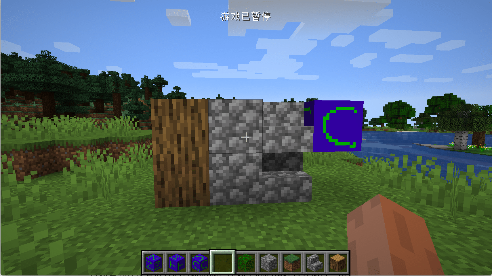

# IBakedModel(烘焙模型)

首先我们从IBakedModel开始讲起。在开始正式写代码之前，我们先要了解如何一个方块是如何渲染出来的

Minecraft本身会读取`json`和材质文件将其转换成`IModel`接口的实例，然后`IModel`进行了「Bake（烘焙）」处理，变成了`IBakedModel`，这个`IBakedModel`会被放入`BlockRendererDispatcher`中，当游戏需要时会直接从`BlockRendererDispatcher`取出`IBakedModel`进行渲染。至于什么是「Bake」，Bake基本上是对模型的材质进行光照计算等操作，让它变成可以直接被GPU渲染的东西。

在这节中我们将来研究如何为我们的方块自定义`IBakedModel`。这节我们将要制作一个「隐藏方块」，这个方块会自动的显示它下方方块的模型的材质（虽然有些Bug，但是为了演示这已经足够了）。

首先是方块`ObsidianHiddenBlock`：

```java
public class ObsidianHiddenBlock extends Block {
    public ObsidianHiddenBlock() {
        super(Properties.create(Material.ROCK).hardnessAndResistance(5).notSolid());
    }
}
```

内容非常的简单，相信大家都看得懂。

然后就是关键所在:`ObsidianHiddenBlockModel`:

```java
public class ObsidianHiddenBlockModel implements IBakedModel {
    IBakedModel defaultModel;
    public static ModelProperty<BlockState> COPIED_BLOCK = new ModelProperty<>();

    public ObsidianHiddenBlockModel(IBakedModel existingModel) {
        defaultModel = existingModel;
    }

    @Nonnull
    @Override
    public List<BakedQuad> getQuads(@Nullable BlockState state, @Nullable Direction side, @Nonnull Random rand, @Nonnull IModelData extraData) {
        IBakedModel renderModel = defaultModel;
        if (extraData.hasProperty(COPIED_BLOCK)) {
            BlockState copiedBlock = extraData.getData(COPIED_BLOCK);
            if (copiedBlock != null) {
                Minecraft mc = Minecraft.getInstance();
                BlockRendererDispatcher blockRendererDispatcher = mc.getBlockRendererDispatcher();
                renderModel = blockRendererDispatcher.getModelForState(copiedBlock);
            }
        }
        return renderModel.getQuads(state, side, rand, extraData);
    }

    @Nonnull
    @Override
    public IModelData getModelData(@Nonnull ILightReader world, @Nonnull BlockPos pos, @Nonnull BlockState state, @Nonnull IModelData tileData) {
        BlockState downBlockState = world.getBlockState(pos.down());
        ModelDataMap modelDataMap = new ModelDataMap.Builder().withInitial(COPIED_BLOCK, null).build();

        if (downBlockState.getBlock() == Blocks.AIR || downBlockState.getBlock() == BlockRegistry.obsidianHidden.get()) {
            return modelDataMap;
        }
        modelDataMap.setData(COPIED_BLOCK, downBlockState);
        return modelDataMap;
    }

    @Override
    public List<BakedQuad> getQuads(@Nullable BlockState state, @Nullable Direction side, Random rand) {
        throw new AssertionError("IBakedModel::getQuads should never be called, only IForgeBakedModel::getQuads");
    }

    @Override
    public boolean isAmbientOcclusion() {
        return defaultModel.isAmbientOcclusion();
    }

    @Override
    public boolean isGui3d() {
        return defaultModel.isGui3d();
    }

    @Override
    public boolean func_230044_c_() {
        return defaultModel.func_230044_c_();
    }

    @Override
    public boolean isBuiltInRenderer() {
        return defaultModel.isBuiltInRenderer();
    }

    @Override
    public TextureAtlasSprite getParticleTexture() {
        return defaultModel.getParticleTexture();
    }

    @Override
    public ItemOverrideList getOverrides() {
        return defaultModel.getOverrides();
    }
}
```

首先是构造函数:

```java
public ObsidianHiddenBlockModel(IBakedModel existingModel) {
  defaultModel = existingModel;
}
```

可以看到，这部分的代码非常的长，但是其实没有你想象的那么复杂，我们一一来讲解。

可以看到这个构造函数传入了一个`IBakedModel`，这个传入的`IBakedModel`就是我们方块默认的模型，因为我们希望我们的方法当放置在半空中时，可以显示默认的模型，所以我们需要保留一份默认的模型。

然后就是最后面的六个方法，作用如下。

| 函数名               | 作用                                         |
| -------------------- | -------------------------------------------- |
| `isAmbientOcclusion` | 控制是否开启环境光遮蔽                       |
| `isGui3d`            | 控制掉落物是否是3D的                         |
| `func_230044_c_()`   | 暂不明，应该和物品的渲染光有关               |
| `isBuiltInRenderer`  | 是否使用内置的渲染，返回`Ture`会使用ISTR渲染 |
| `isBuiltInRenderer`  | 粒子效果材质                                 |
| `getOverrides`       | 获取模型的复写列表                           |

在这里我们直接调用了默认模型的相关方法，就不需要自己设置了。

接下了我们来讲解最为重要的两个方法`getQuads`和`getModelData`，请注意这里面有两个同名的`getQuads`方法，但是参数值不同，其中有3个参数的`getQuads`，是必须要实现的，但是我们不会调用它，因为它没法传入来提供渲染，所以我们直接写了一个异常，来告知我们这个方法被错误的调用。

其中`getQuads`和`getModelData`的关系和作用是，`getQuads`是`IBakedModel`的核心方法，它将返回一堆`Quads`，正如`Quad`这个词就如同它的字面意义那样，一个由四条边组成的形状。如果你对建模有所了解，你应该知道，任何和3D图形其实都是可以用三角形拼成的，在Minecraft里，任何的模型都是用`Quad`拼成的。对于一个普通的方块来说，它需要6个`Quads`，对于一些有着特殊模型的方块，需要的`Quad`数会更多。

当Minecraft开始渲染`IBakedModel`里，它就会调用这个方法获取`Quads`，然后渲染这些`Quads`。

接下来是`getModelData`方法，它的作用是给`getQuads`方法传入额外的数据，`getQuads`方法有一个`IModelData extraData`参数，这里的`extraData`就是通过`getModelData`传入的。`IModelData`的数值也是以「键值对」对信息储存的。

```java
public static ModelProperty<BlockState> COPIED_BLOCK = new ModelProperty<>();
```

`COPIED_BLOCK`就是我们声明的一个「键」，可以看到他的类型是`ModelProperty<BlockState>`，这意味着，相对应「键值对」里「值」对类型是`BlockState`。

然后我们来看`getModelData`方法的具体内容:

```java
@Nonnull
@Override
public IModelData getModelData(@Nonnull ILightReader world, @Nonnull BlockPos pos, @Nonnull BlockState state, @Nonnull IModelData tileData) {
  BlockState downBlockState = world.getBlockState(pos.down());
  ModelDataMap modelDataMap = new ModelDataMap.Builder().withInitial(COPIED_BLOCK, null).build();
  if (downBlockState.getBlock() == Blocks.AIR || downBlockState.getBlock() == BlockRegistry.obsidianHidden.get()) {
    return modelDataMap;
  }
  modelDataMap.setData(COPIED_BLOCK, downBlockState);
  return modelDataMap;
}
```

```java
 BlockState downBlockState = world.getBlockState(pos.down());
```

首先我们获取了「隐藏方块」下方方块的`BlockState`。

```java
ModelDataMap modelDataMap = new ModelDataMap.Builder().withInitial(COPIED_BLOCK, null).build()
```

`ModelDataMap`是`IModelData`接口的唯二两个实现类中的一个，我们这里创建了一个键值对，并且通过`withInitial`设置了初始值：「键：`COPIED_BLOCK`，值：`null`」。

```java
if (downBlockState.getBlock() == Blocks.AIR || downBlockState.getBlock() == BlockRegistry.obsidianHidden.get()) {
    return modelDataMap;
}
```

然后我们判断这个`BlockState`是不是空气，以及是不是又是一个相同的「隐藏方块」，如是就直接返回`ModelDataMap`。

如果不是

```java
modelDataMap.setData(COPIED_BLOCK, downBlockState);
```

通过调用`setData`方法设置了具体的「值」，然后返回。

怎么样这个逻辑不是很难理解吧。

接下去就是核心方法`getQuads`:

```java
@Nonnull
@Override
public List<BakedQuad> getQuads(@Nullable BlockState state, @Nullable Direction side, @Nonnull Random rand, @Nonnull IModelData extraData) {
  IBakedModel renderModel = defaultModel;
  if (extraData.hasProperty(COPIED_BLOCK)) {
    BlockState copiedBlock = extraData.getData(COPIED_BLOCK);
    if (copiedBlock != null) {
      Minecraft mc = Minecraft.getInstance();
      BlockRendererDispatcher blockRendererDispatcher = mc.getBlockRendererDispatcher();
      renderModel = blockRendererDispatcher.getModelForState(copiedBlock);
    }
  }
  return renderModel.getQuads(state, side, rand, extraData);
}
```

这里的逻辑其实也非常简单。

```java
 IBakedModel renderModel = defaultModel;
```

首先设置了默认的渲染模型。

```java
if (extraData.hasProperty(COPIED_BLOCK))
```

然后判断传入的数据有没有`COPIED_BLOCK`这个键。

```java
BlockState copiedBlock = extraData.getData(COPIED_BLOCK);
```

获取`COPIED_BLOCK`这个键，相对应的值。

```java
if (copiedBlock != null)
```

如果值不为`null`。

```java
Minecraft mc = Minecraft.getInstance();
BlockRendererDispatcher blockRendererDispatcher = mc.getBlockRendererDispatcher();
renderModel = blockRendererDispatcher.getModelForState(copiedBlock);
```

就从Minecraft的`getBlockRendererDispatcher`，取出对应`BlockState`的模型，放入`renderModel`中。

```java
return renderModel.getQuads(state, side, rand, extraData);
```

最后向下调用`renderModel`进行渲染，因为调用的`IBakedModel`是Minecraft实现的，所以我们不必去思考到底是怎么渲染的，有兴趣的同学可以自行研究。

以上如此，我们自定义的`IBakedMode`已经创建完毕。

Minecraft 在默认情况下会给方块自动创建一个`IBakeModel`，我们需要替换自动创建的`IBakeModel`，幸运的是Forge提供给我们了一个事件来实现这个功能。

`ModBusEventHandler.java`:

```java
@Mod.EventBusSubscriber(bus = Mod.EventBusSubscriber.Bus.MOD,value = Dist.CLIENT)
public class ModBusEventHandler {
    @SubscribeEvent
    public static void onModelBaked(ModelBakeEvent event) {
        for (BlockState blockstate : BlockRegistry.obsidianHidden.get().getStateContainer().getValidStates()) {
            ModelResourceLocation modelResourceLocation = BlockModelShapes.getModelLocation(blockstate);
            IBakedModel existingModel = event.getModelRegistry().get(modelResourceLocation);
            if (existingModel == null) {
                throw new RuntimeException("Did not find Obsidian Hidden in registry");
            } else if (existingModel instanceof ObsidianHiddenBlockModel) {
                throw new RuntimeException("Tried to replaceObsidian Hidden twice");
            } else {
                ObsidianHiddenBlockModel obsidianHiddenBlockModel = new ObsidianHiddenBlockModel(existingModel);
                event.getModelRegistry().put(modelResourceLocation, obsidianHiddenBlockModel);
            }
        }
    }
}
```

 请注意替换`IBakedModel`是在游戏启动过程替换的，所以我们这里使用的是`Mod.EventBusSubscriber.Bus.MOD`，还有请注意，我们同样不希望它在物理服务器上加载，所以加上了`value = Dist.CLIENT`来确保他只在物理客户端上加载。

```java
@SubscribeEvent
public static void onModelBaked(ModelBakeEvent event)
```

我们监听了`ModelBakeEvent`事件。

接下去的逻辑基本上就是获取我们方块对应的所有`State`，因为每一个不同的方块状态都可能对应着一个不同的模型（虽然我们的方块没有方块状态，但是这个还是要做的）。然后通过`event.getModelRegistry().get`方法从方块状态中获取默认的`IBakedModel`，创建了一个我们自己的`ObsidianHiddenBlockModel`，然后用`event.getModelRegistry().put`替换了进去。

接下了就是常规的注册方块和物品了。

另外我们的方块的状态文件如下:

```json
{
  "variants": {
    "": { "model": "neutrino:block/obsidian_hidden" }
  }
}
```

可以看到并没有额外的方块状态，所以上面的循环只会运行一次。

打开游戏，你就可以看到我们创建的「隐藏方块」了。



在这张图片里上面的方块都是同一种方块。

## 编程小课堂

在Forge里，所以的事件都是`Event`类的子类，所以你可通过查看`Event`类继承树的方式查看到Forge提供的所有事件。

