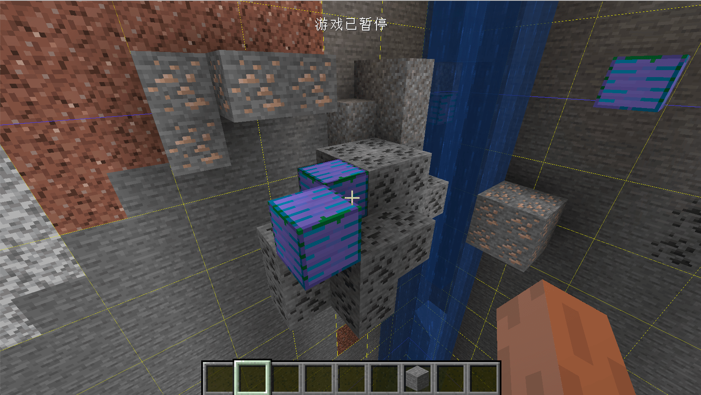

# 矿物生成

在这节中我们将来学习如何进行矿物生成。在学习这件之前请阅读本章的介绍，对世界生成有个大概的印象。

正如我们之前所说的，矿物生属于`Biome` 的个`Feature`，而如果你想要添加矿物生成，其实也就是向生物群系中添加一个新的`Feature`。接下来看代码

```java
@Mod.EventBusSubscriber(bus = Mod.EventBusSubscriber.Bus.MOD)
public class OreGen {
    @SubscribeEvent
    public static void onSetUpEvent(FMLCommonSetupEvent event) {
        for (Biome biome : ForgeRegistries.BIOMES) {
            biome.addFeature(GenerationStage.Decoration.UNDERGROUND_ORES,
                    Feature.ORE.withConfiguration(
                            new OreFeatureConfig(OreFeatureConfig.FillerBlockType.NATURAL_STONE,
                                    BlockRegistry.obsidianBlock.get().getDefaultState(),
                                    3)
                    ).withPlacement(Placement.COUNT_DEPTH_AVERAGE.configure(new DepthAverageConfig(30, 30, 20)))
            );
        }
    }
}
```

没错就这么简单。

因为所有的世界生成都是服务端的行为，所以这里我们自然需要订阅`FMLCommonSetupEvent`事件。

然后我们通过`ForgeRegistries.BIOMES`获取所有注册好的生物群系，并且调用`biome.addFeature`向生物群系中添加`Feature`（也就是我们的矿物）。`Feature`有不同的阶段，这里我们填入的是`GenerationStage.Decoration.UNDERGROUND_ORES`代表矿物生成阶段。然后就是通过`Feature.ORE.withConfiguration`来创建一个矿物生成的`Feature`。

```java
Feature.ORE.withConfiguration(
  new OreFeatureConfig(OreFeatureConfig.FillerBlockType.NATURAL_STONE,
                       BlockRegistry.obsidianBlock.get().getDefaultState(),
                       3))
  .withPlacement(Placement.COUNT_DEPTH_AVERAGE.configure(new DepthAverageConfig(30, 30, 20)))
)
```

`Feature.ORE.withConfiguration`需要传入一个`OreFeatureConfig`用来配置我们的矿物生成`Feature`,因为我们是在主世界生成矿物，所以一个参数填入的是`OreFeatureConfig.FillerBlockType.NATURAL_STONE`，第二个参数指定你要生成方块的默认状态，这里我们选择生成我们之前创建的黑曜石方块，第三个参数控制了每次生成的最大数量。

光这样你的矿物还没发生成，因为你还没有指定你的矿物需要生成在哪里，生成几次。这就是`withPlacement`的作用，这里你要传入一个`Placement`，这个`Placement`是用来控制你的`Feature`需要生成在哪里的，原版提供了很多的`Placement`，这里我们使用`Placement.COUNT_DEPTH_AVERAGE`，调用它的`configure`的方法，里面需要传入一个`DepthAverageConfig`，这里的三个参数分别控制的，每个区块的生成次数，最低生成高度，以及生成范围。

至此，我们的矿物生成以及创建完毕。



可以看见我们的矿物正常的生成了。